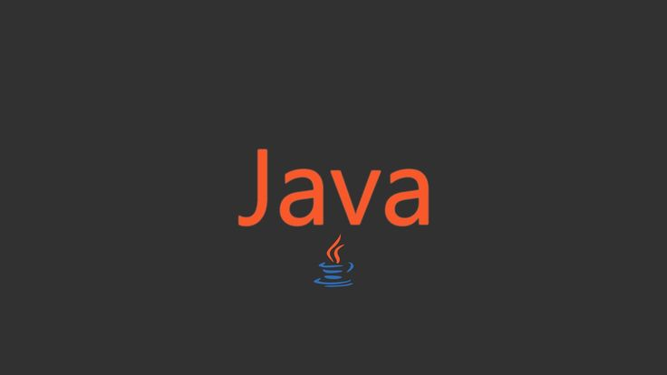

# Основы JavaSE

## Примеры реализаций классов и методов JavaSintax + JavaCore(основные категории):

| [**Интерфейсы Comparable Класс Comparator**](https://github.com/IT-DO/JavaSE/tree/main/src/Java_Core/ComparableAndComparator) 	| [**Коллекции**](https://github.com/IT-DO/JavaSE/tree/main/src/Java_Core/Collections)                	| [**Многопоточность**](src/Java_Core/Multithreading)                                    	|        [**Работа с файлами: IO и NIO**](https://github.com/IT-DO/JavaSE/tree/main/src/Java_Core/InputOutputTests)        	| [**Nested классы**](https://github.com/IT-DO/JavaSE/tree/main/src/Java_Core/NestedClasses)    	| [**Streams**](https://github.com/IT-DO/JavaSE/tree/main/src/Java_Core/StreamAPI)                            	|
|--------------------------------------------	|------------------------------	|--------------------------------------------------------	|:--------------------------------------------:	|----------------------	|----------------------------------------	|
| Интерфейс Comparable                       	| Введение в Collection и List 	| Ввведение в многопоточность                            	| Введение в Стримы. FileWriter                	| Nested классы        	| Streams. Метод map                     	|
| Интерфейс Comparator                       	| ArrayList                    	| Варианты создания потоков                              	| FileReader                                   	| Static Nested класс  	| Метод filter                           	|
| [**Generics**](https://github.com/IT-DO/JavaSE/tree/main/src/Java_Core/Generics)                               	| Методы ArrayList             	| Thread name и Thread priority                          	| Try with resources                           	| Inner класс          	| Метод forEach                          	|
| Parameterized class                        	| Интерфейс Iterator           	| Методы sleep и join. Thread states                     	| BufferedWriter и BufferedReader              	| Local Inner класс    	| Метод reduce                           	|
| Parameterized method                       	| LinkedList                   	| Concurrency и parallelism.  Synchronous и asynchronous 	| FileInputStream и FileOutputStream           	| Anonymous класс      	| Метод sorted                           	|
| Type erasure                               	| Интерфейс ListIterator       	| Ключевое слово volatile                                	| DataInputStream и DataOutputStream           	|                      	| Method chaining                        	|
| Subtyping                                  	| Binary search                	| Data race. Synchronized methods                        	| Сериализация.                                	| [**Lambda выражения**](https://github.com/IT-DO/JavaSE/tree/main/src/Java_Core/Lambdas) 	| Метод concat                           	|
| Wildcards                                  	| Big O notation               	| Понятие «монитор». Synchronized blocks                 	| Класс RandomAccessFile                       	| Lambda выражения     	| Метод distinct                         	|
| Пример на generics                         	| Vector                       	| Методы wait и notify                                   	| Класс File                                   	| Predicate            	| Метод count                            	|
|                                            	| Stack                        	| Понятия Deadlock, Livelock, Lock Starvation            	| Введение в Channel и Buffer. Чтение из файла 	| Supplier             	| Метод peak                             	|
| **Регулярные выражения**                   	| Введение в Map. HashMap      	| Lock и ReentrantLock                                   	| Channel и Buffer. Запись в файл              	| Consumer             	| Метод flatMap                          	|
| RegEx.                                     	| Методы equals и hashCode     	| Daemon потоки                                          	| Channel и Buffer. Важные методы              	| Function             	| Метод collect: grouping и partitioning 	|
| Методы класса String: mathes и split       	| TreeMap                      	| Прерывание потоков                                     	| Интерфейс Path и класс Files.                	|                      	| Метод findFirst                        	|
| Пример «Проверка IP»                       	| LinkedHashMap                	| ThreadPool и ExecutorService.                          	| Введение в метод walkFileTree                	|                      	| Методы min и max                       	|
| Методы replaceAll и group                  	| HashTable                    	| Интерфейсы Callable и Future.                          	| Метод walkFileTree. Копирование директории   	|                      	| Метод limit                            	|
| Методы printf и format                     	| Введение в Set. HashSet      	| Синхронизатор Semaphore                                	| Метод walkFileTree. Удаление директории      	|                      	| Метод skip                             	|
|                                            	| TreeSet                      	| Синхронизатор CountDownLatch                           	|                                              	|                      	| Метод mapToInt                         	|
| [**Date и Time**](https://github.com/IT-DO/JavaSE/tree/main/src/Java_Core/DateTime)                                           	| LinkedHashSet                	| Синхронизатор Exchanger                                	|                                              	|                      	| Parallel Stream                        	|
|                                            	| Введение в Queue. LinkedList 	| Класс AtomicInteger                                    	|                                              	|                      	|                                        	|
|                                            	| PriorityQueue                	| Синхронизированные коллекции                           	|                                              	|                      	|                                        	|
|                                            	| Введение в Deque. ArrayDeque 	| ConcurrentHashMap                                      	|                                              	|                      	|                                        	|
|                                            	|                              	| CopyOnWriteArrayList                                   	|                                              	|                      	|                                        	|
|                                            	|                              	| ArrayBlockingQueue                                     	|                                              	|                      	|                                        	|

# Pet-проекты игровой тематики:

## [SnakeGame - v1.0](https://github.com/IT-DO/JavaSE/tree/main/src/Games/SnakeGame)
## [Hangman - v1.0](https://github.com/IT-DO/JavaSE/tree/main/src/Games/Hangman)
## [TicTacToe - v1.0](https://github.com/IT-DO/JavaSE/tree/main/src/Games/TicTacToe)
## [Chess - SNAPSHOT 1.0](https://github.com/IT-DO/JavaSE/tree/main/src/Games/Chess)
## [Simulation - SNAPSHOT 1.0](https://github.com/IT-DO/JavaSE/tree/main/src/Games/Simulation)

